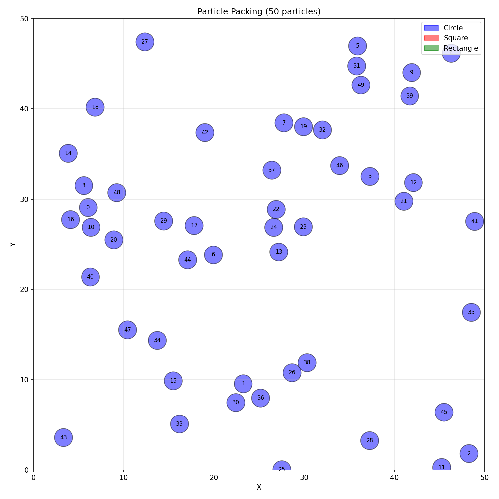

# Random Organization

A 2D particle packing simulation that resolves overlapping shapes through iterative random displacements.

## Background

This project is a reimplementation of my [Bachelor's thesis work](https://journals.aps.org/pre/abstract/10.1103/PhysRevE.88.062308). The original code was lost over time, and I decided to rebuild it from scratch as a hobby project to get back into C++ development. It served as a nice opportunity to explore modern C++20 features and refresh my knowledge of physics simulations.



## Algorithm

The simulation uses a "random organization" algorithm:

1. Initialize N particles at random positions within a defined domain
2. Detect all overlapping particle pairs
3. For each overlap, displace both particles in random opposite directions
4. Repeat until no overlaps remain or the maximum iteration count is reached

## Features

- Support for multiple shape types: circles, rectangles, and squares
- Configurable simulation parameters
- Collision detection for same-type shapes
- Python visualization script for results

## Building

### Requirements

- C++20 compatible compiler
- CMake 3.16+
- Google Test (for unit tests)

### Build

```bash
./build.sh
```


## Usage

```bash
./build/Simulation [circles|rectangles|squares]
```

Example:

```bash
./build/Simulation circles
```

### Visualization

After running a simulation, visualize the results:

```bash
python visualize.py
```

This generates PNG file showing the final particle configuration.

## Configuration

Simulations are configured using the pattern:

```cpp
auto config = SimulationConfiguration()
    .withParticles(100)
    .withArea(50.0, 50.0)
    .withMaxDisplacement(0.5)
    .withMaxIterations(10000)
    .withSeed(42)
    .build();

Simulation sim(config);
sim.Run();
```

## Project Structure

```
├── include/
│   ├── Vec.hpp              # 2D vector mathematics
│   ├── Shape.hpp            # Shape definitions and collision detection
│   ├── ShapeType.hpp        # Shape factory
│   ├── Simulation.hpp       # Simulation engine
│   ├── SimulationConfig.hpp # Configuration builder
│   └── Logger.hpp           # Logging utility
├── src/
│   ├── main.cpp             # Entry point
│   └── Simulation.cpp       # Simulation implementation
├── test/                    # Unit tests
└── visualize.py             # Result visualization
```

## License

MIT License - see [LICENSE](LICENSE) for details.
